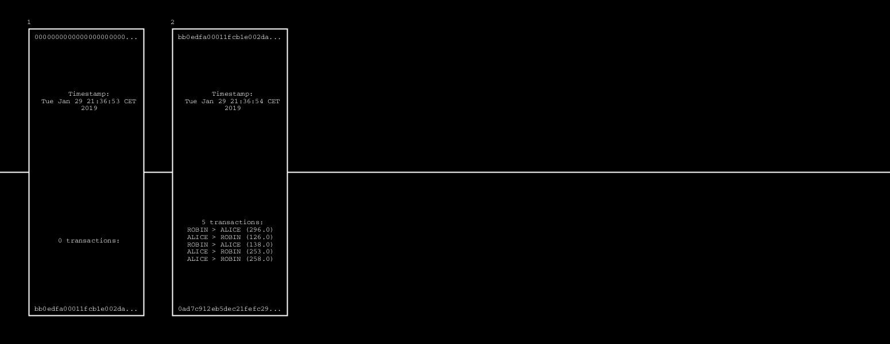

# Introduction

This is a tiny implementation of a blockchain. It randomly generates transactions between virtual participants and draws a modest visual representation of the blockchain. It is written in Java using the [Processing](https://processing.org/) environment. 

In this implementation, the proof of work is the magic number to be computed for each block. It goes increasing by one 0, a block at the time (which is not realistic outside of this example).

# Depedencies

Dependencies have to be saved within the `code` directory of the sketch.

* **For SHA 256 Hashing**: commons-codec-1.11.jar. (Although it could have been possible to use `java.security.MessageDigest.getInstance("SHA-256")`, the Apache library is more convenient to use and it better handles streams conversions.
* **For the public/private key generation**: *Not implemented yet...*

# Run and visualize

1. Clone the repository
1. Make sure the sketch contains the  dependency:`./code/commons-codec-1.11.jar` 
1. Open the project in processing and run or launch it via the command line:  `processing-java --run --sketch=MyBlockchain`
1. The sketch will be drawn on a new window at the resolution asked with the size() method.

# Graphical acceleration

It is possible to consider running the algorithms on the graphical chip using the P2D renderer. However, differences in performances have not been assessed already. 

# Work in progress and issues to address

**Related to the blockchain**:

- [ ] Current implementation does not check for the balance of a participant before accepting a transaction
- [ ] Current implementation permits to easily add a transaction within a block
- [ ] Current implementation does not mine the genesis block, is that normal?
- [ ] Current implementation does not make use of public/private keys for participants
- [ ] Current implementation does not suport P2P

**Related to the code**:

- [ ] Consider adding public/private keywords for the variables and method fields (is not a concern with processing's pre-processor)
- [ ] Consider implementing try-catching
- [ ] Consider adding unitary tests
- [ ] Consider documenting properly the code with Javadoc
